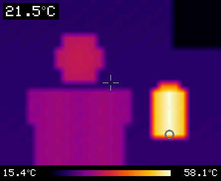
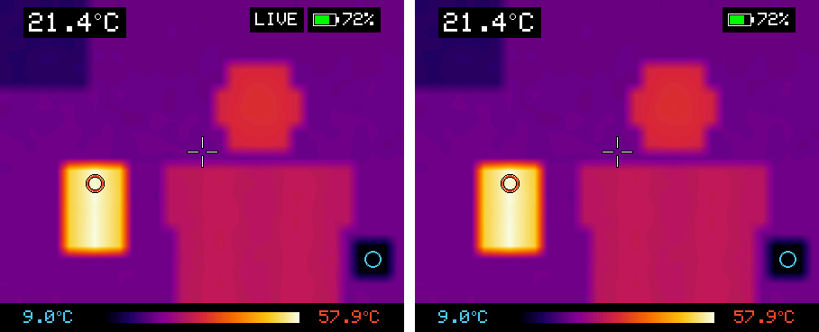
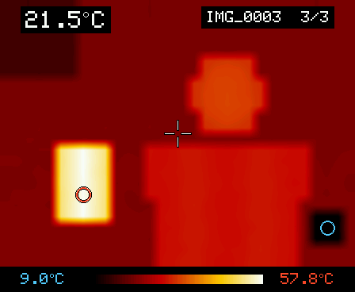

# ESP32-S3 AMOLED Thermal Camera

Live thermal video from a **Waveshare MLX90640 thermal camera module** ("MLX9064X Thermal Camera" board) on a **Waveshare ESP32-S3-Touch-AMOLED-1.8** (368×448 AMOLED).



*Simulated preview with a fake scene (a person, a hot mug, a cold can, a cold window). It was made by running this sketch's drawing code on a PC.*

- The 32×24 sensor image is upscaled to fill the screen (448×336, landscape).
- Top left: temperature at the crosshair (the center of the image).
- Red ring: the hottest spot. Blue ring: the coldest spot. Their temperatures are at the right and left ends of the bar at the bottom, in the same colors.
- The bar's color scale adjusts itself to the scene.
- Top right: battery level, with a lightning bolt while charging. It shows "USB" when running without a battery.
- Swipe left to right to look through saved pictures, and right to left to return to the camera.
- The picture is smoothed over time, so readings and markers stay steady while you aim. In simulation this made the center reading about 3 times steadier, and the markers stopped jumping between equally hot pixels. They still follow a moving object within about 0.1 s.
- After a minute without use, a 10-second countdown appears. Tap the screen to keep going. Otherwise the camera turns off.
- A second board with the same firmware and no sensor works as a wireless screen for the camera.
- The picture updates 16 times a second.
- Both board revisions work: the original (SH8601 display) and V2 (CO5300 display). The sketch detects which one you have.

| Wireless screen (right) mirroring the camera (left) | Picture viewer |
| --- | --- |
|  |  |

*Screenshots are simulated, like the preview above.*

## Safety and privacy first

This is a hobby thermal imager, **not a medical instrument, fire alarm or
life/safety-critical detector**. Do not rely on it for diagnosis, body-temperature
screening, fire detection or proving electrical equipment safe. Surface emissivity,
reflections, distance and sensor warm-up affect readings.

The default wireless-screen mode broadcasts thermal data over **unencrypted,
unauthenticated ESP-NOW**. There is no secure pairing. Anyone nearby can listen or
impersonate a camera/screen. Set `WIRELESS_SCREEN false` in `ThermalCam/config.h`
for sensitive scenes. Saved BMP/CSV captures are unencrypted on microSD and are
not automatically erased. Current source disables sensor-ID/temperature logging
by default; do not share identifying debug logs or real captures. See [SECURITY.md](SECURITY.md).

Use **3.3 V** sensor power and logic, common ground, short wires and check the
silkscreen before soldering. Disconnect power while wiring. This is specifically
the **1.8-inch AMOLED V1/V2** board, not a round/LCD board.

## Hardware

- [Waveshare ESP32-S3-Touch-AMOLED-1.8](https://www.waveshare.com/esp32-s3-touch-amoled-1.8.htm), original or V2
- Waveshare MLX90640 thermal camera module ("MLX9064X Thermal Camera" board), the D55 (55°) or D110 (110°) version
- Optional: a microSD card (FAT32) for saving pictures, and a LiPo battery for the board's battery connector
- Optional: a second ESP32-S3-Touch-AMOLED-1.8 to use as a wireless screen

## Controls

**Camera:**

| Control | Action |
| --- | --- |
| BOOT, short press | Next palette: Ironbow → Rainbow → Hot → White hot → Black hot |
| BOOT, hold (~1 s) | Switch between °C and °F |
| PWR, short press | Save a picture to the microSD card. When off, it turns the camera on. |
| Swipe left to right | Open the picture viewer |

**Picture viewer** (opens on the newest picture):

| Control | Action |
| --- | --- |
| Tap the left half | Previous (older) picture |
| Tap the right half | Next (newer) picture |
| BOOT, short press | Previous (older) picture |
| Swipe right to left, or PWR | Back to the camera |

**Anywhere:** a long PWR press turns the board off (the power chip handles that itself). Tapping the screen keeps the camera on during the auto-off countdown, or wakes a dark screen. A touch or press that wakes the screen does nothing else.

The board remembers your palette and unit choice after power-off.

## Wireless screen

Flash the **same firmware** to a second ESP32-S3-Touch-AMOLED-1.8 that has **no thermal sensor** attached. At startup it looks for a sensor, finds none, and becomes a wireless screen. It then shows the camera's live picture, with the same palette, units, markers and readings.

- No Wi-Fi router or pairing is needed. The boards talk directly over ESP-NOW; expect a range of about a room or more.
- Before the camera is on, the screen shows **Waiting for the thermal camera**. It shows that page again if the camera turns off or goes out of range.
- While a screen is listening, the camera shows **LIVE** next to its battery level. The camera only transmits while a screen is listening. It also doesn't auto-off then, because someone is watching it remotely.
- Palette and °C/°F follow the camera. Change them on the camera; pressing BOOT on the screen's live view just says so.
- PWR on the screen saves the picture it's showing to the **screen's own** microSD card. Swiping left to right on the screen browses the pictures on that card.
- The screen stays on while pictures arrive. When they stop, it shows **Lost the camera's signal**. A 10-second countdown starts after 10 seconds, and the screen turns off after 20. Tap it to keep waiting. It also turns off 20 seconds after startup if no camera shows up.
  - **On battery:** it powers off. Press PWR to turn it back on.
  - **On USB power:** only its display goes dark, and it comes back by itself when the camera's pictures return.
- While you browse saved pictures on the screen, the normal 60-second auto-off applies instead.
- If several cameras are nearby, the screen stays with the first one it hears.
- The radio uses extra battery on the camera. Set `WIRELESS_SCREEN false` in `config.h` if you never use a second screen. Both boards must use the same `WIRELESS_CHANNEL`.

## Auto-off

The camera counts as idle when nobody presses a button, touches the screen, or plugs in or unplugs USB. After 50 idle seconds a countdown appears, and at 60 seconds:

- **On battery:** the camera powers off completely. Press **PWR** to turn it back on.
- **On USB power:** only the screen turns off. Tap it, or press any button, to wake it. Waking presses don't change the palette or save a picture.

Change the times with `IDLE_OFF_SECONDS` and `IDLE_WARNING_SECONDS` in `config.h`, or set `IDLE_OFF_SECONDS` to 0 to turn auto-off off.

## Saving pictures

Put a FAT32-formatted microSD card in the slot. Each short press of **PWR** saves two files into a `thermal` folder on the card:

- `IMG_0001.bmp`: the screen exactly as shown, with the readings and color scale (448×368 pixels).
- `IMG_0001.csv`: the 32×24 temperatures in °C, laid out like the picture. It opens in Excel or Numbers.

The top-right corner briefly shows **Saved IMG_0001**. If no card is found, it shows **No SD card**. Numbering continues from the last picture, even after power-off. Swipe left to right to look at your pictures on the camera.

## 1. Check which sensor you have

This code is for the **MLX90640** (32×24 pixels). Waveshare sells the same blue board with an **MLX90641** (16×12 pixels), and that sensor needs a different driver. Your product listing or bag should say "MLX90640-D55" / "MLX90640-D110" (D55 = 55° field of view, D110 = 110°; both work with this code). You can also read the marking on the round metal sensor can. If yours says MLX90641, the code needs changes.

## 2. Wiring

The sensor has 4 wires. Trace each one back to its label on the sensor board (SCL / SDA / GND / VCC). Don't go by wire color.

| Sensor board | ESP32-S3-AMOLED-1.8 pad |
| --- | --- |
| VCC | **3V3** |
| GND | **GND** |
| SDA | **SDA** (I2C pad, GPIO15) |
| SCL | **SCL** (I2C pad, GPIO14) |

The AMOLED board's expansion pads are small (1.27 mm pitch) solder pads. Cut off the Dupont plugs and solder the wires on, or solder a short 1.27 mm header. Check the silkscreen next to the pads.

The I2C pads connect to the board's internal I2C bus, which the touch, power and clock chips also use. That's fine: the MLX90640 has its own address (0x33), and this is the setup the sketch expects by default.

**Using two GPIO pads instead of the I2C pads?** Put those GPIO numbers in `THERMAL_SDA` / `THERMAL_SCL` in `ThermalCam/config.h`. The sensor then gets its own I2C bus at 800 kHz.

**Mounting:** put the sensor on the back of the board, pointing away from you. If the picture moves the wrong way when you pan, change `MIRROR_IMAGE` in `config.h`. If it's upside down, change `SCREEN_ROTATION` from 1 to 3.

## 3a. Quick flash (no Arduino needed, default settings)

**Prefer building the current source.** The retained
`firmware/ThermalCam-full-flash-at-0x0.bin` is an **unverified legacy artifact**,
not a proven build of the current source; the new source privacy/parser fixes
are not asserted to be present in it. See [firmware/README.md](firmware/README.md)
and [firmware/manifest.json](firmware/manifest.json) for the exact hash, length
and **0x0** merged-image offset. Verify the checksum before using it. A checksum
is byte identity, not source provenance or safety certification. Flashing can
replace stored device data; back up only to a private location. The instructions
below are for an owner choosing to use the legacy image, not an audit test.

1. Open <https://espressif.github.io/esptool-js/> in Chrome or Edge.
2. Plug in the board and click **Connect**. If no port shows up, unplug, then hold **BOOT** while plugging the board back in.
3. Set the flash address to **0x0**, choose the `.bin` file, and click **Program**.
4. Unplug and replug the board (or press its power button) to start it.

## 3b. Build it yourself (Arduino IDE 2.x)

1. **Board support:** go to *File → Preferences → Additional boards manager URLs* and add
   `https://espressif.github.io/arduino-esp32/package_esp32_index.json`.
   Then open *Boards Manager* and install **esp32 by Espressif Systems** (version 3.x).
2. **Library:** in *Library Manager*, install **GFX Library for Arduino** (by Moon On Our Nation). The thermal sensor driver comes with the project, in `ThermalCam/src/mlx90640`.
3. **Board settings** (*Tools* menu):
   | Setting | Value |
   | --- | --- |
   | Board | ESP32S3 Dev Module |
   | USB CDC On Boot | Enabled |
   | Flash Size | 16MB (128Mb) |
   | Partition Scheme | 16M Flash (3MB APP/9.9MB FATFS) |
   | **PSRAM** | **OPI PSRAM** ← required. The screen buffer lives in PSRAM. |
4. Open `ThermalCam/ThermalCam.ino` and click **Upload**.
5. Optional: open the Serial Monitor at 115200 baud for status messages.
   Scene-temperature statistics and the unique sensor serial number are disabled
   by default. Only enable `LOG_THERMAL_STATS` / `LOG_SENSOR_SERIAL` for private debugging.

The original README recorded esp32 core **3.3.12** with GFX Library for Arduino
**1.6.8**. That historical claim is not a new hardware or binary-provenance
certification. Pin both versions rather than silently using an arbitrary `3.x`.

### Reproducible compile recipe (no upload)

Install Arduino CLI, then use these exact dependency versions in your own
Arduino data directory (these commands download dependencies; they do not flash):

```sh
arduino-cli core update-index --additional-urls https://espressif.github.io/arduino-esp32/package_esp32_index.json
arduino-cli core install esp32:esp32@3.3.12 --additional-urls https://espressif.github.io/arduino-esp32/package_esp32_index.json
arduino-cli lib install "GFX Library for Arduino@1.6.8"
arduino-cli compile --fqbn 'esp32:esp32:esp32s3:USBMode=hwcdc,CDCOnBoot=cdc,FlashSize=16M,PartitionScheme=app3M_fat9M_16MB,PSRAM=opi' --build-path /tmp/thermal-camera-build ThermalCam
```

GFX 1.6.8 corresponds to upstream commit
`2685a776495be1f9eaf8c572cf876469bcc56585`; the vendored Melexis driver revision
is recorded in its own README. The sketch entry is `ThermalCam.ino`; implementation
is ordinary `ThermalCam.cpp`, avoiding Arduino automatic prototype-generation
differences. All existing wiring and UI/radio defaults are preserved.

Build outputs are private by default. Before distributing a binary, inspect
embedded paths, IDs and strings; preserve required third-party licenses; record
the exact source commit, core/library revisions, command, partition layout,
flash offsets and SHA-256. Custom compiler flags must **preserve the platform's
required defaults** (for example `-MMD -c` on core 3.0.0); prefix-map personal
source/toolchain paths when preparing publishable artifacts. Do not mistake a
standalone application `.bin` for a merged 0x0 image.

### Current verification limits

The October 3, 2026 source check compiled the sketch and bundled Melexis
translation units with the existing esp32 **3.0.0** toolchain, but the full build
failed inside GFX 1.6.8: that old core lacks the required ESP-IDF parallel-display
APIs (`dma_burst_size` / `esp_lcd_i80_alloc_draw_buffer`). **There is no successful
full-firmware build or hardware test from that audit.** Core 3.3.12 is the pinned
recipe above, not a newly certified build. Use the documented compatible
versions; do not remove library code just to manufacture a successful build.

### Offline development checks

```sh
python3 tools/privacy_check.py
python3 -m unittest discover -s tests -v
git diff --check
```

Requires Python 3.9+ and Clang/GCC with C++11 and address/undefined-behavior
sanitizers. Tests exercise malformed BMP headers, palette endpoints, privacy
regressions, preserved defaults, ignore rules and the legacy manifest checksum.
CI runs these offline checks only; it does not build the ESP32 firmware or test
a physical board. The worktree privacy checker does not replace a full Git
history, compressed archive, binary or credential review. See [CONTRIBUTING.md](CONTRIBUTING.md).

## Settings (`ThermalCam/config.h`)

| Setting | Default | What it does |
| --- | --- | --- |
| `THERMAL_SDA` / `THERMAL_SCL` | 15 / 14 | Sensor I2C pins |
| `SENSOR_REFRESH_HZ` | 16 | Sensor sub-page rate: 4, 8, 16 or 32. 32 is noisier and only keeps up on a dedicated bus. |
| `SMOOTHING` | 0.6 | Smoothing over time: 0 = off (raw and jumpy) up to 0.9 (very steady, but slow to follow movement) |
| `SCREEN_ROTATION` | 1 | 1 or 3 = landscape, 0 or 2 = portrait (smaller picture) |
| `MIRROR_IMAGE` | true | Flip the picture left/right. True is correct with the sensor pointing away from you. |
| `FLIP_IMAGE` | false | Turn the picture upside down |
| `SCREEN_BRIGHTNESS` | 200 | 0-255 |
| `SCREEN_CORNER_RADIUS` | 48 | Size of the screen's rounded corners in pixels. Text near the corners moves inward to clear them. |
| `START_IN_FAHRENHEIT` | false | Starting unit (the BOOT button overrides it) |
| `WIRELESS_SCREEN` | true | A board without a sensor becomes a wireless screen for the camera. False turns the radio off. |
| `WIRELESS_CHANNEL` | 1 | Radio channel 1-13; the same on both boards |
| `SCREEN_LINK_TIMEOUT_SECONDS` | 20 | The wireless screen turns off this long after the camera's pictures stop (0 = never) |
| `IDLE_OFF_SECONDS` | 60 | Turn off after this many idle seconds (0 = never) |
| `IDLE_WARNING_SECONDS` | 10 | Length of the "tap screen to keep using" countdown |
| `MIN_SPAN_C` | 3.0 | Smallest temperature range the colors stretch over. Stops noise from looking like detail. |
| `LOG_SENSOR_SERIAL` | false | Print the unique sensor ID over USB serial (private debugging only) |
| `LOG_THERMAL_STATS` | false | Print scene temperatures and frame rate over USB serial (private debugging only) |

## Troubleshooting

- **"No SD card" when saving:** the card must be microSD, formatted FAT32 (cards of 32 GB or less come that way). Push it in until it clicks.
- **Corner text still clipped:** raise `SCREEN_CORNER_RADIUS` in `config.h`.
- **"Sensor not found" on screen:** the screen lists every I2C address it can see.
  - Other devices listed but no `0x33`: the bus works, but the sensor isn't connected. Check VCC/GND and that SDA/SCL aren't swapped.
  - `none`: the pins in `config.h` don't match where you soldered.
- **"PSRAM is off" on screen:** set *Tools → PSRAM → OPI PSRAM* and upload again.
- **Black screen, nothing at all:** unplug the board and plug it back in without holding BOOT; it won't run the new firmware while it's still in flashing mode. If it's still black, read the board's status messages. In the Arduino IDE, open the Serial Monitor at 115200 baud. On the esptool-js page, use the **Console** section: click **Connect**, pick the port, then click **Reset**. When no sensor is connected, a status line repeats every 2 seconds and names the display revision and PSRAM size.
- **"Sensor stopped" after it was working:** loose wire, or a long or noisy cable. Keep the sensor wires short.
- **Checkerboard pattern on moving objects:** the shared bus isn't keeping up with the sensor. Set `SENSOR_REFRESH_HZ` to 8.
- **Picture lags behind when you pan:** lower `SMOOTHING`. **Still too jumpy:** raise it.
- **Your camera says "Wireless screen":** it didn't find its sensor at startup, so it switched to screen mode. The I2C line on that page shows what it did find. Check the sensor wires as for "Sensor not found". The screen and the camera must run the same firmware version.
- **Wireless screen keeps waiting:** turn the camera on, and check both boards use the same `WIRELESS_CHANNEL`. Keep them in the same room at first.
- **Swipes don't register:** swipe across at least a sixth of the screen, mostly sideways.
- **Readings seem low on shiny metal:** this is normal for all thermal cameras. Shiny surfaces reflect heat instead of giving it off. Readings assume emissivity 0.95, which is right for skin, wood, paint, plastic and food. Put a piece of matte tape on metal to measure it.
- The sensor reads about ±1-2 °C absolute. It settles after a few minutes of warm-up.

## How it works

- The sensor is read on CPU core 0 with Melexis' own MLX90640 driver (`ThermalCam/src/mlx90640`, Apache License 2.0). Each sub-page is read as soon as the sensor has it, and the resulting frame is passed to core 1.
- Core 1 blends each frame into a running average (`SMOOTHING`). The markers go on the hottest and coldest 3×3 patch, and only move when another spot is clearly hotter or colder. The readouts and the color scale ease toward new values more gently still.
- Core 1 then upscales the 32×24 frame with integer bilinear interpolation into a full-screen RGB565 frame buffer in PSRAM. It draws the overlays and sends the whole buffer to the AMOLED over QSPI.
- Before the display starts, the sketch pulses the reset lines on the board's IO expander, the same way Waveshare's examples do. Both panels are started with the CO5300 init sequence, as Waveshare's own board driver does. The V2 panel also needs a 16-column offset. The sketch applies it unless the original board's FT3168 touch chip answers.
- Once running, the sensor task on core 0 is the only code that uses the board's I2C bus. While it waits for the sensor, it also reads the power chip (PWR button and battery) and the touch chip, about 100 times a second. That rate is fast enough to tell taps from swipes. Core 1 reads the results, so no two tasks ever talk on the bus at the same time.
- The viewer lists `IMG_*.bmp` in the card's `thermal` folder and decodes the chosen one into the frame buffer.
- Wireless screen: the screen broadcasts a short hello twice a second over ESP-NOW. While the camera hears one, it broadcasts each smoothed frame after processing it: one packet of settings and readouts, then 7 packets of temperatures in 1/100 °C. The screen puts the frame back together and draws it with the same code as the camera. So it matches the camera's screen to within 0.01 °C, apart from the LIVE badge.

## License and credits

- Original project code is released under the MIT License (see [LICENSE](LICENSE)); existing ownership is preserved and new contributions are credited to ESP32 Thermal Camera contributors.
- The thermal sensor driver in `ThermalCam/src/mlx90640` is [Melexis' MLX90640 library](https://github.com/melexis/mlx90640-library), under the Apache License 2.0.
- The display code uses [GFX Library for Arduino](https://github.com/moononournation/Arduino_GFX), and the firmware is built on the [Arduino core for the ESP32](https://github.com/espressif/arduino-esp32).
- Waveshare's examples and board support package were the reference for the board's pins and display startup.
- This project isn't affiliated with Waveshare or Melexis. See [THIRD_PARTY.md](THIRD_PARTY.md) for dependency notices and firmware redistribution limits.
