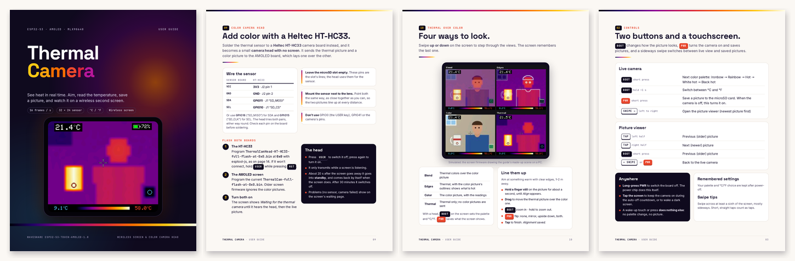
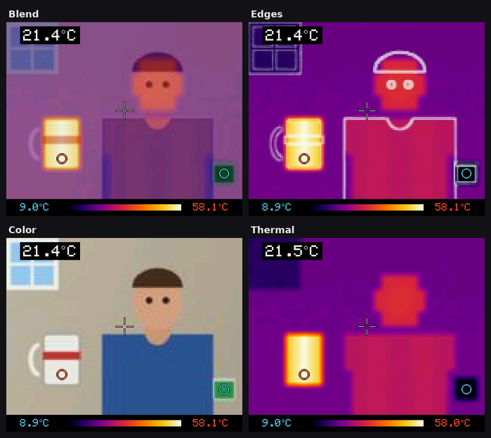

# ESP32-S3 AMOLED Thermal Camera

Live thermal video from a **Waveshare MLX90640 thermal camera module** ("MLX9064X Thermal Camera" board) on a **Waveshare ESP32-S3-Touch-AMOLED-1.8** (368×448 AMOLED).


*Simulated preview with a fake scene (a person, a hot mug, a cold can, a cold window). It was made by running this sketch's drawing code on a PC.*

## User guide

**[Download the illustrated user guide (PDF, 14 pages)](docs/user-guide.pdf)**: reading the screen, controls, palettes, saving and viewing pictures, the wireless screen, standby, the HT-HC33 color camera head, auto-off, accurate readings, troubleshooting and updating the firmware.

[](docs/user-guide.pdf)

- The 32×24 sensor image is upscaled to fill the screen (448×336, landscape).
- Top left: temperature at the crosshair (the center of the image).
- Red ring: the hottest spot. Blue ring: the coldest spot. Their temperatures are at the right and left ends of the bar at the bottom, in the same colors.
- The bar's color scale adjusts itself to the scene.
- Top right: battery level, with a lightning bolt while charging. It shows "USB" when running without a battery.
- Swipe left to right to look through saved pictures, and right to left to return to the camera.
- The picture is smoothed over time, so readings and markers stay steady while you aim. In simulation this made the center reading about 3 times steadier, and the markers stopped jumping between equally hot pixels. They still follow a moving object within about 0.1 s.
- After a minute without use, a 10-second countdown appears. Tap the screen to keep going. Otherwise the camera turns off.
- A second board with the same firmware and no sensor works as a wireless screen for the camera. On battery, each one waits in standby for the other and turns back on when it does.
- A **Heltec HT-HC33** camera board with the sensor soldered on works as a headless **thermal + color camera**. The wireless screen lays the thermal picture over the color one (see [Thermal + color camera head](#thermal--color-camera-head-heltec-ht-hc33)).
- The picture updates 16 times a second.
- Both board revisions work: the original (SH8601 display) and V2 (CO5300 display). The sketch detects which one you have.

| Wireless screen (right) mirroring the camera (left) | Picture viewer |
| --- | --- |
|  |  |

*Screenshots are simulated, like the preview above.*

## Safety and privacy first

This is a hobby thermal imager, **not a medical instrument, fire alarm or
life/safety-critical detector**. Do not rely on it for diagnosis, body-temperature
screening, fire detection or proving electrical equipment safe. Surface emissivity,
reflections, distance and sensor warm-up affect readings.

The default wireless-screen mode broadcasts thermal data over **unencrypted,
unauthenticated ESP-NOW**. There is no secure pairing. Anyone nearby can listen or
impersonate a camera/screen. Set `WIRELESS_SCREEN false` in `ThermalCam/config.h`
for sensitive scenes. The HT-HC33 camera head also broadcasts **color
pictures** the same way, so anyone nearby with an ESP32 can see what it sees.
Saved BMP/CSV captures are unencrypted on microSD and are
not automatically erased. Current source disables sensor-ID/temperature logging
by default; do not share identifying debug logs or real captures. See [SECURITY.md](SECURITY.md).

Use **3.3 V** sensor power and logic, common ground, short wires and check the
silkscreen before soldering. Disconnect power while wiring. This is specifically
the **1.8-inch AMOLED V1/V2** board, not a round/LCD board.

## Hardware

- [Waveshare ESP32-S3-Touch-AMOLED-1.8](https://www.waveshare.com/esp32-s3-touch-amoled-1.8.htm), original or V2
- Waveshare MLX90640 thermal camera module ("MLX9064X Thermal Camera" board), the D55 (55°) or D110 (110°) version
- Optional: a microSD card (FAT32) for saving pictures, and a LiPo battery for the board's battery connector
- Optional: a second ESP32-S3-Touch-AMOLED-1.8 to use as a wireless screen
- Optional: a Heltec HT-HC33 (ESP32-S3 with a color camera) as a thermal + color camera head, with the AMOLED board as its screen

## Controls

**Camera:**

| Control | Action |
| --- | --- |
| BOOT, short press | Next palette: Ironbow → Rainbow → Hot → White hot → Black hot |
| BOOT, hold (~1 s) | Switch between °C and °F |
| PWR, short press | Save a picture to the microSD card. When off, it turns the camera on. |
| Swipe left to right | Open the picture viewer |

**Picture viewer** (opens on the newest picture):

| Control | Action |
| --- | --- |
| Tap the left half | Previous (older) picture |
| Tap the right half | Next (newer) picture |
| BOOT, short press | Previous (older) picture |
| Swipe right to left, or PWR | Back to the camera |

**Anywhere:** a long PWR press turns the board off (the power chip handles that itself). Tapping the screen keeps the camera on during the auto-off countdown, or wakes a dark screen. A touch or press that wakes the screen does nothing else.

The board remembers your palette and unit choice after power-off.

## Wireless screen

Flash the **same firmware** to a second ESP32-S3-Touch-AMOLED-1.8 that has **no thermal sensor** attached. At startup it looks for a sensor, finds none, and becomes a wireless screen. It then shows the camera's live picture, with the same palette, units, markers and readings.

- No Wi-Fi router or pairing is needed. The boards talk directly over ESP-NOW; expect a range of about a room or more.
- Before the camera is on, the screen shows **Waiting for the thermal camera**. It shows that page again if the camera turns off or goes out of range.
- The camera only transmits while a screen is listening, and never auto-offs then, because someone is watching it remotely.
- The camera's own display **goes dark** while a screen watches, to save battery. Tap it or press a button to turn it on (that press does nothing else); it then shows **LIVE** next to its battery level, and goes dark again after a minute without use.
- When the screen goes away (switched off, asleep or out of range), the camera turns off about 20 seconds later (with the usual countdown, if its display is on). Using the camera in the meantime brings back the normal 60 seconds.
  - **On battery:** the camera goes into **standby**. Every 5 seconds it wakes for a moment and listens for a screen that is switched on, so it turns back on by itself within a few seconds of you turning the screen on. A tap or BOOT turns it on straight away; PWR works too, but is only noticed at the next check. After 30 minutes in standby without a screen it powers off completely. Its thermal sensor stays powered in standby, so the camera uses more battery there than a sleeping screen does.
  - **On USB power:** the camera keeps running with its display dark, and streams again as soon as a screen connects.
- Palette and °C/°F follow the camera. Change them on the camera; pressing BOOT on the screen's live view just says so.
- PWR on the screen saves the picture it's showing to the **screen's own** microSD card. Swiping left to right on the screen browses the pictures on that card.
- The screen stays on while pictures arrive. When they stop, it shows **Lost the camera's signal**. A 10-second countdown starts after 10 seconds, and the screen turns off after 20. Tap it to keep waiting. It also turns off 20 seconds after startup if no camera shows up.
  - **On battery:** it goes into **standby**. Every 5 seconds it wakes for a moment and asks whether the camera is on, so it turns back on by itself within about 5 seconds of the camera turning on. A tap or BOOT turns it on straight away; PWR works too, but is only noticed at the next check. After 30 minutes in standby without the camera, it powers off completely; then press PWR to turn it on.
  - **On USB power:** only its display goes dark, and it comes back by itself as soon as the camera's pictures return.
- While you browse saved pictures on the screen, the normal 60-second auto-off applies instead.
- If several cameras are nearby, the screen stays with the first one it hears.
- The radio uses extra battery on the camera. Set `WIRELESS_SCREEN false` in `config.h` if you never use a second screen. Both boards must use the same `WIRELESS_CHANNEL`.

## Thermal + color camera head (Heltec HT-HC33)

A [Heltec HT-HC33](https://heltec.org/) (an ESP32-S3 board with an OV3660 color camera) with the MLX90640 soldered on becomes a **camera head with no display**. It streams the thermal frames and small color pictures to the AMOLED board, which shows them laid on top of each other.



*Simulated: the screen firmware drawing a made-up scene on a PC. The person, mug, can and window are the thermal tests' scene.*

**You need:** the HT-HC33 (V1), the Waveshare MLX90640 module (D55 or D110), and an ESP32-S3-Touch-AMOLED-1.8 as the screen, without a sensor.

### Wiring the sensor to the HT-HC33

| Sensor board | HT-HC33 |
| --- | --- |
| VCC | **3V3** (J2 pin 1) |
| GND | **GND** (J2 pin 2) |
| SDA | **GPIO11** (J1, labeled `SD_MOSI` on Heltec's pin map) |
| SCL | **GPIO10** (J1, labeled `SD_CS`) |

- These are the microSD slot's lines, so **leave the microSD slot empty**.
- If GPIO11/10 are awkward to reach, use **GPIO16** (`SD_MISO`) for SDA and **GPIO15** (`SD_CLK`) for SCL instead.
  - The head tries both pairs, either way round, so it also finds the sensor with SDA and SCL swapped.
  - Leave GPIO0 (the USER key), GPIO41 and the camera pins alone.
- Check each pin on the board's silkscreen and Heltec's pin map before soldering. These pins come from Heltec's Arduino board definition and the datasheet; the schematic wasn't available.
- Mount the sensor right next to the camera lens and point it the same way. The closer they are, the better the two pictures line up at every distance.

### Flashing

Flash each board with esptool-js at **0x0**, as in [Quick flash](#3a-quick-flash-no-arduino-needed-default-settings).

- **HT-HC33:** use `firmware/ThermalCamHead-HT-HC33-full-flash-at-0x0.bin` (8 MB).
  - The HT-HC33 has a USB-serial chip, so it normally connects by itself.
  - If it doesn't, hold **USER** while pressing **RST**, then click Connect.
- **AMOLED screen:** use the current `firmware/ThermalCam-full-flash-at-0x0.bin`. Older screen firmware ignores the color pictures. This one file still works as the AMOLED thermal camera and as its wireless screen.

### Using it

Turn on both boards. The screen shows **Waiting for the thermal camera** until it hears the head, then the live picture.

**Views:** swipe **up or down** on the screen to step through them. The screen remembers the last one.

| View | What you see |
| --- | --- |
| **Blend** | Thermal colors over the color picture |
| **Edges** | The thermal picture with the color picture's outlines drawn in. Shows *what* is hot most clearly. |
| **Color** | The color picture alone, with the temperature readings and markers |
| **Thermal** | The thermal picture alone. The head stops sending color pictures, which saves radio time. |

**Controls on the screen with a camera head:**

- **BOOT:** short press = next palette, hold = °C/°F. With a camera head these are set on the screen, because the head has no buttons for them.
- **PWR:** save what the screen shows to the screen's microSD card.
- **Swipe left to right:** open the picture viewer.

**Lining up the pictures:** point at something warm with clear edges, such as a mug or your hand, 1–2 m away. Then:

1. Hold a finger still on the picture for about a second, until **Align** appears. The screen switches to Blend.
2. Drag to move the thermal picture over the color one.
3. BOOT short press = zoom in; hold = zoom out. Use these if the outlines are bigger or smaller than the warm shapes.
4. PWR = flip the thermal picture: none, mirror, upside down, both.
5. **Tap** to finish. The screen shows **Alignment saved** and keeps it after power-off.

**On the head:**

- The **USER key** switches the head off; press it again to turn it on.
- Like the AMOLED camera, the head only transmits while a screen is listening.
- About 20 seconds after the screen goes away, the head goes into standby. It wakes every 5 seconds to listen and streams again when the screen comes back. After 30 minutes it switches off completely; then use the USER key.
- If the head has a problem, the screen's waiting page says what it is. For example, "Thermal sensor not found" lists the pins to check.
- If the color pictures stop (weak radio, camera problem), the screen falls back to the thermal picture after 2 seconds.

### Head settings (`ThermalCamHead/config.h`)

| Setting | Default | What it does |
| --- | --- | --- |
| `THERMAL_SDA` / `THERMAL_SCL` | 11 / 10 | Sensor pins tried first |
| `THERMAL_ALT_SDA` / `THERMAL_ALT_SCL` | 16 / 15 | Sensor pins tried next |
| `SENSOR_REFRESH_HZ` | 16 | Sensor sub-page rate: 4, 8, 16 or 32 |
| `SMOOTHING` / `MIN_SPAN_C` | 0.6 / 3.0 | As on the AMOLED camera |
| `COLOR_FRAME_SIZE` | `FRAMESIZE_QVGA` | Color picture size: 320×240, about 10 pictures a second. `FRAMESIZE_VGA` (640×480) is sharper but slower, and needs a strong radio link. |
| `COLOR_JPEG_QUALITY` | 14 | 10 (best) to 40 (smallest) |
| `COLOR_MAX_FPS` | 10 | Most color pictures per second |
| `COLOR_VFLIP` / `COLOR_HMIRROR` | true / false | Turn the color picture the right way round |
| `WIRELESS_CHANNEL` | 1 | The same as the screen's |
| `RADIO_RATE` | `WIFI_PHY_RATE_11M_L` | Radio speed for the pictures. `WIFI_PHY_RATE_24M` is faster, with less range. |
| `CAMERA_LINK_TIMEOUT_SECONDS`, `STANDBY_CHECK_SECONDS`, `STANDBY_MINUTES` | 20, 5, 30 | Standby, as on the AMOLED camera |

The screen's settings for this are under [Settings](#settings-thermalcamconfigh): `FUSION_BLEND_PERCENT`, `FUSION_EDGE_PERCENT`, `THERMAL_FOV_DEG` and `COLOR_FOV_DEG`.

**Building the head yourself:**

1. Open `ThermalCamHead/ThermalCamHead.ino`. It needs no extra libraries; the camera driver comes with the ESP32 core.
2. Set these board options:

   | Setting | Value |
   | --- | --- |
   | Board | ESP32S3 Dev Module |
   | USB CDC On Boot | Disabled |
   | Flash Size | 8MB |
   | Partition Scheme | 8M with spiffs (3MB APP/1.5MB SPIFFS) |
   | PSRAM | OPI PSRAM |

   The pinned options are `esp32:esp32:esp32s3:USBMode=hwcdc,CDCOnBoot=default,FlashSize=8M,PartitionScheme=default_8MB,PSRAM=opi`.

### Limits

- **Not tested on hardware.** The behaviour was checked in the [host simulator](tools/hostsim/README.md) only.
- The camera's lens is assumed to see about 120° across, more than either sensor version.
  - The D55 sensor covers only the middle half of the color picture. The overlaid color is therefore about 160×120 pixels, enlarged and soft.
  - `FRAMESIZE_VGA` makes it sharper. The D110 sensor matches the lens better.
  - If your lens differs, change `COLOR_FOV_DEG` or just align on the screen.
- The sensor and lens sit a few centimetres apart. Aligned at one distance, the pictures drift slightly apart much nearer than that.
- The color pictures need far more radio time than the thermal frames, so the range is shorter than with the AMOLED camera.
- The thermal sensor stays powered in standby.
- The board's Wi-Fi HaLow module isn't used; the head holds it in reset.

## Auto-off

The camera counts as idle when nobody presses a button, touches the screen, or plugs in or unplugs USB. After 50 idle seconds a countdown appears, and at 60 seconds:

- **On battery:** the camera powers off completely. Press **PWR** to turn it back on. If a wireless screen was connected, it goes into standby instead and turns back on with the screen (see [Wireless screen](#wireless-screen)).
- **On USB power:** only the screen turns off. Tap it, or press any button, to wake it. Waking presses don't change the palette or save a picture.

Change the times with `IDLE_OFF_SECONDS` and `IDLE_WARNING_SECONDS` in `config.h`, or set `IDLE_OFF_SECONDS` to 0 to turn auto-off off.

## Saving pictures

Put a FAT32-formatted microSD card in the slot. Each short press of **PWR** saves two files into a `thermal` folder on the card:

- `IMG_0001.bmp`: the screen exactly as shown, with the readings and color scale (448×368 pixels).
- `IMG_0001.csv`: the 32×24 temperatures in °C, laid out like the picture. It opens in Excel or Numbers.

The top-right corner briefly shows **Saved IMG_0001**. If no card is found, it shows **No SD card**. Numbering continues from the last picture, even after power-off. Swipe left to right to look at your pictures on the camera.

## 1. Check which sensor you have

This code is for the **MLX90640** (32×24 pixels). Waveshare sells the same blue board with an **MLX90641** (16×12 pixels), and that sensor needs a different driver. Your product listing or bag should say "MLX90640-D55" / "MLX90640-D110" (D55 = 55° field of view, D110 = 110°; both work with this code). You can also read the marking on the round metal sensor can. If yours says MLX90641, the code needs changes.

## 2. Wiring

The sensor has 4 wires. Trace each one back to its label on the sensor board (SCL / SDA / GND / VCC). Don't go by wire color.

| Sensor board | ESP32-S3-AMOLED-1.8 pad |
| --- | --- |
| VCC | **3V3** |
| GND | **GND** |
| SDA | **SDA** (I2C pad, GPIO15) |
| SCL | **SCL** (I2C pad, GPIO14) |

The AMOLED board's expansion pads are small (1.27 mm pitch) solder pads. Cut off the Dupont plugs and solder the wires on, or solder a short 1.27 mm header. Check the silkscreen next to the pads.

The I2C pads connect to the board's internal I2C bus, which the touch, power and clock chips also use. That's fine: the MLX90640 has its own address (0x33), and this is the setup the sketch expects by default.

**Using two GPIO pads instead of the I2C pads?** Put those GPIO numbers in `THERMAL_SDA` / `THERMAL_SCL` in `ThermalCam/config.h`. The sensor then gets its own I2C bus at 800 kHz.

**Mounting:** put the sensor on the back of the board, pointing away from you. If the picture moves the wrong way when you pan, change `MIRROR_IMAGE` in `config.h`. If it's upside down, change `SCREEN_ROTATION` from 1 to 3.

## 3a. Quick flash (no Arduino needed, default settings)

`firmware/ThermalCam-full-flash-at-0x0.bin` is a new **source-attested build**
of commit `259bf17c67609b251c08e4be7969831bfb50d698`, using core **3.3.12**
and GFX **1.6.8** with the parser hardening, private logging defaults,
wireless-screen and camera standby, and the color camera head views. Flash the same file to the camera and to a wireless screen.
The HT-HC33 camera head has its own image, `firmware/ThermalCamHead-HT-HC33-full-flash-at-0x0.bin`
(see [Thermal + color camera head](#thermal--color-camera-head-heltec-ht-hc33)).
Two independent local compiles produced identical ELF, application and merged
bytes. See [firmware/manifest.json](firmware/manifest.json) for provenance and
[firmware/README.md](firmware/README.md) for the exact checksum and **0x0** offset.

**No hardware test is claimed.** The image is a complete 16 MB flash layout,
with blank NVS, FAT and coredump partitions; programming it replaces stored device settings/data.
Back up existing device data only to a private location. A matching checksum
proves byte identity, not hardware suitability or absence of every possible
encoded secret. The older image's source correspondence remains unproven;
Git history was not rewritten. Default ESP-NOW is still open broadcast.
The following steps are owner-operated flashing instructions, not an audit test.

1. Open <https://espressif.github.io/esptool-js/> in Chrome or Edge.
2. Plug in the board and click **Connect**. If no port shows up, unplug, then hold **BOOT** while plugging the board back in.
3. Set the flash address to **0x0**, choose the `.bin` file, and click **Program**.
4. Unplug and replug the board (or press its power button) to start it.

## 3b. Build it yourself (Arduino IDE 2.x)

1. **Board support:** go to *File → Preferences → Additional boards manager URLs* and add
   `https://espressif.github.io/arduino-esp32/package_esp32_index.json`.
   Then open *Boards Manager* and install **esp32 by Espressif Systems** (**version 3.3.12**).
2. **Library:** in *Library Manager*, install **GFX Library for Arduino 1.6.8** (by Moon On Our Nation). The thermal sensor driver comes with the project, in `ThermalCam/src/mlx90640`.
3. **Board settings** (*Tools* menu):
   | Setting | Value |
   | --- | --- |
   | Board | ESP32S3 Dev Module |
   | USB Mode | Hardware CDC and JTAG (`hwcdc`) |
   | USB CDC On Boot | Enabled |
   | Flash Size | 16MB (128Mb) |
   | Partition Scheme | 16M Flash (3MB APP/9.9MB FATFS) |
   | **PSRAM** | **OPI PSRAM** ← required. The screen buffer lives in PSRAM. |
4. Open `ThermalCam/ThermalCam.ino` and click **Upload**.
5. Optional: open the Serial Monitor at 115200 baud for status messages.
   Scene-temperature statistics and the unique sensor serial number are disabled
   by default. Only enable `LOG_THERMAL_STATS` / `LOG_SENSOR_SERIAL` for private debugging.

### Pinned release build (no upload)

The complete October 9, 2026 builds (Linux x86_64) passed with Arduino CLI **1.5.1**, esp32 core
**3.3.12**, ESP-IDF **5.5.5**, Xtensa GCC **14.2.0**, esptool **5.3.1** and GFX
**1.6.8** (revision `2685a776495be1f9eaf8c572cf876469bcc56585`).
The exact board options are:

```text
esp32:esp32:esp32s3:USBMode=hwcdc,CDCOnBoot=cdc,FlashSize=16M,PartitionScheme=app3M_fat9M_16MB,PSRAM=opi
```

Use [firmware/BUILDING.md](firmware/BUILDING.md) for the **complete isolated
install/neutral-path compile recipe and release gate**. It uses a private Arduino
configuration/data/library/cache directory, fixed `SOURCE_DATE_EPOCH`, and
prefix maps while retaining core `-MMD -c`/SDK flags. No global Arduino install
needs changing. The sketch entry remains `ThermalCam.ino`, with ordinary C++
implementation in `ThermalCam.cpp`; wiring/UI/radio/power defaults are preserved.

Two full compiles in separate new output directories and separate initially
empty core caches produced **byte-identical ELF, app, bootloader, partition,
boot-app0 and merged images** on the same Linux x86_64 host. This is a measured
local repeatability result, not a cross-host or indefinite bitwise-reproducibility
guarantee. The core embeds the build host's OS name, so builds on different host
operating systems differ in that string. With only that label overridden, a
Linux rebuild of the previous macOS-built source matched every application byte
except the embedded ELF hash (see [firmware/README.md](firmware/README.md)).
The manifest records source commit/tree/files, relevant dependency
archive hashes, actual ELF/app/merged SHA-256, verified offsets and blank NVS.
Its preceding source commit avoids circular manifest self-reference.

### Verification limits

There was **no board access, upload, serial session or hardware test**. Native
parser/privacy tests and actual firmware compilation do not prove display,
sensor, SD, radio or power behavior on hardware. The SDK's inherited application
name/version/date are not thermal source identity; the embedded ELF hash matches
the actual build, with the source mapping in the manifest. Only the newly rebuilt
current binary has that mapping; older historical binaries remain source-unproven.
Offline privacy checks are heuristic, and independent entropy/release review is
separate from compilation. See [THIRD_PARTY.md](THIRD_PARTY.md) for retained
notices and source/rebuild requirements; the complete binary is not solely MIT.

### Offline development checks

```sh
python3 tools/privacy_check.py
python3 -m unittest discover -s tests -v
git diff --check
```

Requires Python 3.9+ and Clang/GCC with C++11 and address/undefined-behavior
sanitizers. Tests exercise malformed BMP headers, palette endpoints, privacy
regressions, preserved defaults, ignore rules, source/notice hashes, current manifest checksum, merged components,
image integrity, partition layout and blank NVS for both firmware images, and that the screen and camera head share one link protocol.
CI runs these offline checks only; it does not build the ESP32 firmware or test
a physical board. For behaviour (markers, wireless link, standby, camera head and color views), run the host
simulation tests in [tools/hostsim](tools/hostsim/README.md). Release image helpers are
in `tools/release/`, and the user guide's source is in [docs/guide](docs/guide/README.md). The worktree privacy checker does not replace a full Git
history, compressed archive, binary or credential review. See [CONTRIBUTING.md](CONTRIBUTING.md).

## Settings (`ThermalCam/config.h`)

| Setting | Default | What it does |
| --- | --- | --- |
| `THERMAL_SDA` / `THERMAL_SCL` | 15 / 14 | Sensor I2C pins |
| `SENSOR_REFRESH_HZ` | 16 | Sensor sub-page rate: 4, 8, 16 or 32. 32 is noisier and only keeps up on a dedicated bus. |
| `SMOOTHING` | 0.6 | Smoothing over time: 0 = off (raw and jumpy) up to 0.9 (very steady, but slow to follow movement) |
| `SCREEN_ROTATION` | 1 | 1 or 3 = landscape, 0 or 2 = portrait (smaller picture) |
| `MIRROR_IMAGE` | true | Flip the picture left/right. True is correct with the sensor pointing away from you. |
| `FLIP_IMAGE` | false | Turn the picture upside down |
| `SCREEN_BRIGHTNESS` | 200 | 0-255 |
| `SCREEN_CORNER_RADIUS` | 48 | Size of the screen's rounded corners in pixels. Text near the corners moves inward to clear them. |
| `START_IN_FAHRENHEIT` | false | Starting unit (the BOOT button overrides it) |
| `WIRELESS_SCREEN` | true | A board without a sensor becomes a wireless screen for the camera. False turns the radio off. |
| `WIRELESS_CHANNEL` | 1 | Radio channel 1-13; the same on both boards |
| `SCREEN_LINK_TIMEOUT_SECONDS` | 20 | The wireless screen turns off this long after the camera's pictures stop (0 = never) |
| `CAMERA_DISPLAY_OFF_WITH_SCREEN` | true | The camera's display stays dark while a wireless screen shows the picture; a tap or button turns it on |
| `CAMERA_LINK_TIMEOUT_SECONDS` | 20 | The camera turns off (standby on battery) this long after its wireless screen goes away (0 = no camera standby, normal auto-off) |
| `STANDBY_CHECK_SECONDS` | 5 | In standby, the screen or camera looks for the other board this often. Shorter turns on sooner but uses more battery. |
| `STANDBY_MINUTES` | 30 | A board in standby powers off completely after this long (0 = no standby, power off straight away) |
| `FUSION_BLEND_PERCENT` | 55 | With a color camera head: how strongly Blend's thermal colors cover the color picture (0-100) |
| `FUSION_EDGE_PERCENT` | 75 | With a color camera head: how bright Edges draws the color picture's outlines (0-100) |
| `THERMAL_FOV_DEG` / `COLOR_FOV_DEG` | 55 / 120 | Starting alignment: how wide the thermal sensor and the color camera see, in degrees. Fine-tune on the screen. |
| `IDLE_OFF_SECONDS` | 60 | Turn off after this many idle seconds (0 = never) |
| `IDLE_WARNING_SECONDS` | 10 | Length of the "tap screen to keep using" countdown |
| `MIN_SPAN_C` | 3.0 | Smallest temperature range the colors stretch over. Stops noise from looking like detail. |
| `LOG_SENSOR_SERIAL` | false | Print the unique sensor ID over USB serial (private debugging only) |
| `LOG_THERMAL_STATS` | false | Print scene temperatures and frame rate over USB serial (private debugging only) |

## Troubleshooting

- **"No SD card" when saving:** the card must be microSD, formatted FAT32 (cards of 32 GB or less come that way). Push it in until it clicks.
- **Corner text still clipped:** raise `SCREEN_CORNER_RADIUS` in `config.h`.
- **"Sensor not found" on screen:** the screen lists every I2C address it can see.
  - Other devices listed but no `0x33`: the bus works, but the sensor isn't connected. Check VCC/GND and that SDA/SCL aren't swapped.
  - `none`: the pins in `config.h` don't match where you soldered.
- **"PSRAM is off" on screen:** set *Tools → PSRAM → OPI PSRAM* and upload again.
- **Black screen, nothing at all:** unplug the board and plug it back in without holding BOOT; it won't run the new firmware while it's still in flashing mode. If it's still black, read the board's status messages. In the Arduino IDE, open the Serial Monitor at 115200 baud. On the esptool-js page, use the **Console** section: click **Connect**, pick the port, then click **Reset**. When no sensor is connected, a status line repeats every 2 seconds and names the display revision and PSRAM size.
- **"Sensor stopped" after it was working:** loose wire, or a long or noisy cable. Keep the sensor wires short.
- **Checkerboard pattern on moving objects:** the shared bus isn't keeping up with the sensor. Set `SENSOR_REFRESH_HZ` to 8.
- **Picture lags behind when you pan:** lower `SMOOTHING`. **Still too jumpy:** raise it.
- **Your camera says "Wireless screen":** it didn't find its sensor at startup, so it switched to screen mode. The I2C line on that page shows what it did find. Check the sensor wires as for "Sensor not found". The screen and the camera must run the same firmware version.
- **Wireless screen keeps waiting:** turn the camera on, and check both boards use the same `WIRELESS_CHANNEL`. Keep them in the same room at first.
- **Swipes don't register:** swipe across at least a sixth of the screen, mostly sideways.
- **Readings seem low on shiny metal:** this is normal for all thermal cameras. Shiny surfaces reflect heat instead of giving it off. Readings assume emissivity 0.95, which is right for skin, wood, paint, plastic and food. Put a piece of matte tape on metal to measure it.
- The sensor reads about ±1-2 °C absolute. It settles after a few minutes of warm-up.

## How it works

- The sensor is read on CPU core 0 with Melexis' own MLX90640 driver (`ThermalCam/src/mlx90640`, Apache License 2.0). Each sub-page is read as soon as the sensor has it, and the resulting frame is passed to core 1.
- Core 1 blends each frame into a running average (`SMOOTHING`). The markers go on the hottest and coldest 3×3 patch, and only move when another spot is clearly hotter or colder. The readouts and the color scale ease toward new values more gently still.
- Core 1 then upscales the 32×24 frame with integer bilinear interpolation into a full-screen RGB565 frame buffer in PSRAM. It draws the overlays and sends the whole buffer to the AMOLED over QSPI.
- Before the display starts, the sketch pulses the reset lines on the board's IO expander, the same way Waveshare's examples do. Both panels are started with the CO5300 init sequence, as Waveshare's own board driver does. The V2 panel also needs a 16-column offset. The sketch applies it unless the original board's FT3168 touch chip answers.
- Once running, the sensor task on core 0 is the only code that uses the board's I2C bus. While it waits for the sensor, it also reads the power chip (PWR button and battery) and the touch chip, about 100 times a second. That rate is fast enough to tell taps from swipes. Core 1 reads the results, so no two tasks ever talk on the bus at the same time.
- The viewer lists `IMG_*.bmp` in the card's `thermal` folder and decodes the chosen one into the frame buffer.
- Wireless screen: the screen broadcasts a short hello twice a second over ESP-NOW. While the camera hears one, it broadcasts each smoothed frame after processing it: one packet of settings and readouts, then 7 packets of temperatures in 1/100 °C. The screen puts the frame back together and draws it with the same code as the camera. So it matches the camera's screen to within 0.01 °C, apart from the LIVE badge.
- Standby: the board's chip goes into deep sleep with its display off, and a timer wakes it every few seconds. A screen sends a "probe" hello and listens for half a second; the camera answers a probe with one frame but doesn't count it as a viewer, so a sleeping screen doesn't keep the camera from auto-off. A camera listens for 0.6 s for an ordinary hello, which only a switched-on screen sends (twice a second); it ignores probes, so two boards in standby can't keep waking each other up. The touch interrupt and BOOT can also wake the chip. The PWR button can't, because it goes to the power chip, which only latches the press until the next check.

- Camera head: the HT-HC33 reads the sensor on core 0, like the AMOLED camera, and sends the same frame packets marked "headless". While the screen's hellos ask for color (any view but Thermal), the head also takes JPEG pictures from the camera. It sends each one in 1400-byte pieces (ESP-NOW v2) at 11 Mbps. The screen reassembles each picture, decodes it on core 0 and finds its outlines (a Sobel filter). Core 1 then draws the chosen view, pixel by pixel, through the saved alignment.

## License and credits

- Original project code is released under the MIT License (see [LICENSE](LICENSE)); existing ownership is preserved and new contributions are credited to ESP32 Thermal Camera contributors.
- The thermal sensor driver in `ThermalCam/src/mlx90640` is [Melexis' MLX90640 library](https://github.com/melexis/mlx90640-library), under the Apache License 2.0.
- The display code uses [GFX Library for Arduino](https://github.com/moononournation/Arduino_GFX), and the firmware is built on the [Arduino core for the ESP32](https://github.com/espressif/arduino-esp32).
- Waveshare's examples and board support package were the reference for the board's pins and display startup.
- This project isn't affiliated with Waveshare or Melexis. See [THIRD_PARTY.md](THIRD_PARTY.md) for dependency notices and firmware redistribution limits.
